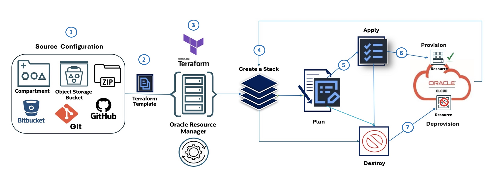

### Option 2: Automating OKE with OCI Resource Manager   

**OCI Resource Manager (ORM)** is the ideal choice when you need a managed, cloud-native solution for infrastructure deployments. It’s particularly suited for collaborative, enterprise environments where security, centralized state management, and governance are critical. ORM’s key advantage is that it handles the entire deployment lifecycle within OCI, securely storing the state file and preventing conflicts. This eliminates the need for local setup or managing a shared backend. Furthermore, ORM's deep integration with the Oracle Cloud allows it to leverage OCI-native features like Identity and Access Management (IAM), enhancing security and control.

In this tutorial, we combine OCI Resource Manager (ORM) with OCI CLI, Bash, and integrate them into Jenkins CI/CD pipelines, offering a complete  `one-click`   automation flow with additional DevOps capabilities such as drift detection, secure state management, and team collaboration with versioning for compatibility.  

**OCI Resource Manager Flow**  
The following diagram illustrates the ORM workflow, composed of seven steps:  
  
1. **Source Configuration**: Defines the origin of the IaC configuration (for example, OCI Object Storage, GitHub, Zip file).  
2. **Terraform Template**: The infrastructure is defined using Terraform.  
3. **OCI Resource Manager**: ORM takes the Terraform template and manages the provisioning process.  
4. **Create a Stack**: ORM uses the template to create a stack of OCI resources.  
5. **Plan**: Generates a plan outlining the actions to be taken.  
6. **Apply**: Provisions the resources based on the plan.  
7. **Destroy**: Deprovisions the resources when no longer needed.  

To deploy an OKE cluster using the new module from OCI Resource Manager (ORM), start by downloading the advanced module for ORM: [`oke_advanced_module_orm.zip`](./files/oke_advanced_module_orm.zip "file"). This version is pre-configured for ORM, with variables set to generic placeholders such as `REPLACE_WITH_YOUR_OWN_VARIABLE_VALUE`.  

#### Task 2.1: Source Configuration  

Update `variables.tf` with your environment-specific details, such as region, networking CIDRs, and flags to control resource creation (VCN, OKE cluster, node pool, bastion host).  

The following bash script creates the ORM resources sources zip file.

- **Bash Script: `create_new_oke_stack_source.sh`**.
```bash
    #!/bin/bash

    # Define the source directory for the stack
    src_dir="~/oke_advanced_module_orm/oke_app_src"

    # Create the zip archive from the source code with overwrite 
    rm -f "$src_dir/stackconfig.zip"
    cd $src_dir 
    zip -r "../stackconfig.zip" * modules/

    # List the contents of the zip file for verification
    /usr/bin/unzip -l "$src_dir/stackconfig.zip"
```

>Verify your source directory (`~/oke_advanced_module_orm`) to make sure a file named `stackconfig.zip` contains all the terraform resource definitions.

#### Task 2.2: Create OCI Resource Manager Stack  
Use the OCI CLI to create an ORM stack. The script below simplifies the process:  

**Bash Script: `create_new_oke_stack.sh`**.
```bash
    #!/bin/bash
    
    # Load environment variables (e.g., COMPARTMENT_ID, STACK_NAME, etc.)
    source "./env-vars"

    # Create the Oracle Resource Manager stack and capture the OCID
    stack_output=$(oci resource-manager stack create \
    --compartment-id "$COMPARTMENT_ID" --display-name "$STACK_NAME" \
    --description "$STACK_DESCRIPTION" --config-source "$CONFIG_SOURCE")

    # Extract the OCID of the newly created stack and display it
    STACK_OCID=$(echo "$stack_output" | jq -r '.data.id')

    echo "Stack OCID: $STACK_OCID"
```

#### Task 2.3: Execute Stack Plan Job  
Run the `Plan` job to verify changes before applying them. This dry run provides transparency into the infrastructure changes.  

**Bash Script: `create_oke_stack_plan_job.sh`**
```bash
    #!/bin/bash

    # Load environment variables (e.g., STACK_OCID)
    source "./env-vars"

    # Create a plan job for the specified stack
    plan_job_output=$(oci resource-manager job create-plan-job \
        --stack-id "$STACK_OCID")

    # Extract the OCID of the plan job and check for errors
    PLAN_JOB_OCID=$(echo "$plan_job_output" | jq -r '.data.id')
    if [[ -z "$PLAN_JOB_OCID" ]]; then
        echo "Error: Failed to retrieve plan job OCID." >&2
        exit 1
    fi

    echo "Plan job OCID: $PLAN_JOB_OCID"
```

#### Task 2.4: Create Apply Job  
Provision the OKE cluster and associated resources such as node pool using the `Apply` job.  

**Bash Script: `create_oke_stack_apply_job.sh`**
```bash
    #!/bin/bash

    # Load environment variables (e.g., STACK_OCID, EXEC_PLAN_STRATEGY)
    source "./env-vars"

    # Create an apply job for the specified stack
    apply_job_output=$(oci resource-manager job create-apply-job \
        --stack-id "$STACK_OCID" \
        --execution-plan-strategy "$EXEC_PLAN_STRATEGY")

    # Extract the OCID of the apply job and check for errors
    APPLY_JOB_OCID=$(echo "$apply_job_output" | jq -r '.data.id')
    if [[ -z "$APPLY_JOB_OCID" ]]; then
        echo "Error: Failed to retrieve apply job OCID." >&2
        exit 1
    fi

    echo "Apply job OCID: $APPLY_JOB_OCID"
```

#### Task 2.5: Execute Destroy Job  
Clean up resources by running the `Destroy` job when the environment is no longer needed.  

**Bash Script: `create_oke_stack_destroy_job.sh`**
```bash
    #!/bin/bash

    # Load environment variables (e.g., STACK_OCID, EXEC_PLAN_STRATEGY)
    source "./env-vars"

    # Create an  jotroy for the specified stack
    apply_job_output=$(oci resource-manager job create-destroy-job \
        --stack-id "$STACK_OCID"  \
        --execution-plan-strategy "$EXEC_PLAN_STRATEGY")

    # Extract the OCID of the destroy job and check for errors
    DESTROY_JOB_OCID=$(echo "$apply_job_output" | jq -r '.data.id')
    if [[ -z "$DESTROY_JOB_OCID" ]]; then
        echo "Error: Failed to retrieve destroy job OCID." >&2
        exit 1
    fi

    echo "Apply job OCID: $DESTROY_JOB_OCID"
```