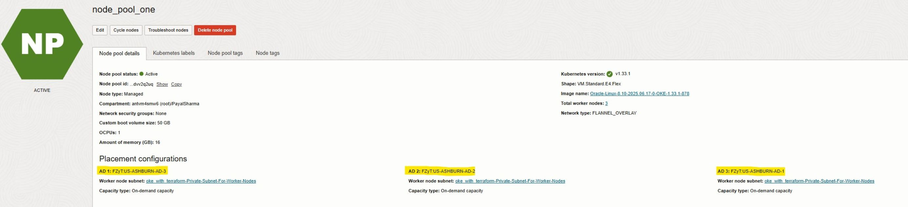
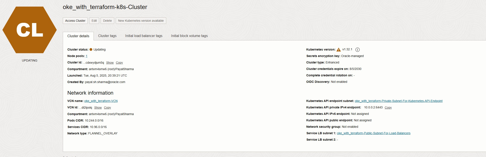
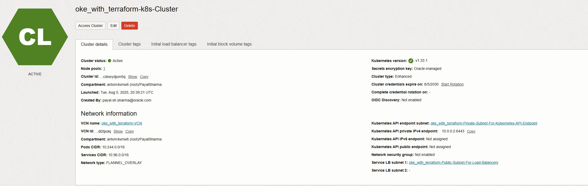
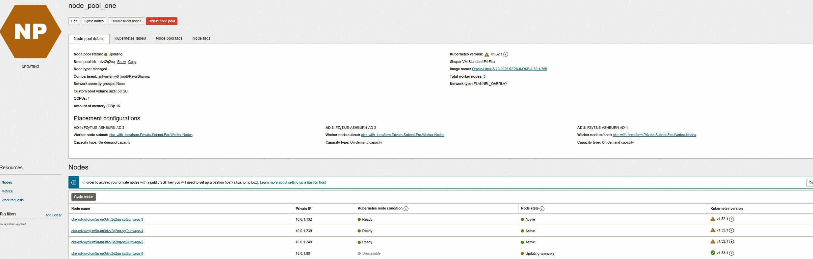
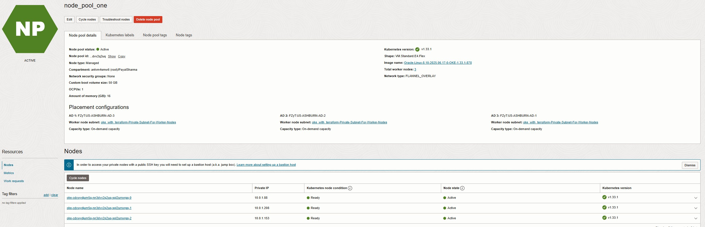

### Lab 3: Demonstrate key OKE capability using OKE cluster

In this lab, you’ll focus on a selected set of best practices that help improve the reliability, maintainability, and cost efficiency of your Oracle Container Engine for Kubernetes (OKE) environment. 

You will walk through three core capabilities:

- Distribute nodes across availability domains to improve high availability and reduce the risk of service disruption.
- Use node cycling to upgrade OKE node pools and perform controlled, zero-downtime node refresh operations.
- Use OCI tagging on OKE worker nodes and load balancers to track and organize costs across projects, teams, or environments.

By the end of this lab, you’ll understand how these foundational practices strengthen your OKE cluster’s resilience, streamline upgrades, and provide clearer cost visibility.

#### 1. Distribute nodes across availability domains

To improve resiliency and high availability, distribute your OKE worker nodes across multiple Availability Domains (ADs) in a regional subnet. This ensures your application continues to run even if one AD experiences a failure. For workloads using regional node pools, OCI handles this automatically.

To demonstrate this on a Multi-AD region, specify three availability domains in `availability_domains` parameter in the `worker_node_pools` section. Once you have added the availability domains to your `terraform.tfvars`, run `terraform apply` to create worker nodes across those availability domains. For single AD deployments, OCI automatically distributes worker nodes across the three Fault Domains (FDs) within that AD, providing additional resiliency against localized hardware or rack failures.

 

#### 2. Use node cycling to upgrade OKE node pools.

OCI supports node cycling, a safe way to update node images, Kubernetes versions, or system configurations without disrupting cluster availability. Node cycling performs a rolling replacement of nodes, keeping workloads accessible throughout the upgrade.

OKE currently offers two node cycling types:

- **INSTANCE_REPLACE:**  Deletes and recreates nodes from scratch, allowing updates to all attributes.

- **BOOT_VOLUME_REPLACE (BVR):** Replaces only the boot volume, supporting in-place updates for a subset of fields.

The parameters `maximum_surge` and `maximum_unavailable` control how OKE balances upgrade speed and availability during the rolling process:

- `maximum_surge`: Specifies how many additional nodes can be created temporarily beyond the desired node count during the update. For example, setting this to 1 allows OKE to provision one new node before removing an old one, maintaining full capacity.

- `maximum_unavailable`: Specifies how many nodes can be unavailable (draining or being replaced) at the same time. Setting this to 0 ensures all nodes stay operational until new nodes are ready.

Using `maximum_surge` = 1 and `maximum_unavailable` = 0 provides a safe, zero-downtime update strategy. OKE adds a new node, waits for it to become healthy, and only then replaces the old one.

The following illustes an node cycling example with Max surge 1 and Max unavailable 0.
 

To trigger the upgrade of an existing OKE cluster that leads to node cycling:

In your `terraform.tfvars` file:
- Set `node_cycling_enabled` = true
- Update the `control_plane_kubernetes_version` and `worker_nodes_kubernetes_version`
- Change the `kubernetes_version` to the desired version as above for automatic image selection.
  - Set the `cycle_modes` to `BOOT_VOLUME_REPLACE` for in-place update

Then run `terraform plan`

You should see output like this:
	
- OKE Cluster upgrade: 
  - kubernetes_version = "v1.32.1" -> "v1.33.1"
- Node Pool upgrade: 
  - kubernetes_version = "v1.32.1" -> "v1.33.1" 
  - image_id           = "old_image_id" -> "new_image_id"
- Node replacements: 
  - state              = "ACTIVE" -> "DELETED"

when you execute `terraform apply` it will start upgrading the cluster. Once the control plane upgrade completes, you will see something like this:

 
 
	
It will then begin cycling the node pools one by one, upgrading each to the new version and image:

 
 


#### 3. Use OCI tagging on OKE worker nodes and load balancers to track costs

When running Kubernetes workloads in Oracle Cloud Infrastructure (OCI), it’s essential to understand where your costs are coming from. Tagging is the key. OCI allows you to apply defined and freeform tags to every resource, including OKE clusters, worker nodes, load balancers, and persistent volumes.

Why tagging matters:

- Cost Tracking: Assign tags such as Project, Environment, or Owner to monitor spending per team or project.
- Organization: Easily filter resources in OCI based on their purpose or lifecycle.
- Governance: Enforce standards across teams and ensure accountability.

```
# Cluster-level tagging
cluster_freeform_tag_key   = "Environment"
cluster_freeform_tag_value = "Development"

# Node pool-level tagging
node_pool_freeform_tag_key   = "LOB"
node_pool_freeform_tag_value = "DevOps Tech"

# Bastion host tagging
freeform_tags = {
  project     = "devops"
  environment = "production"}

```

With these tags in place, you can generate detailed cost reports in OCI Cost Analysis, identify which workloads are consuming the most resources, and make informed decisions about scaling or optimization.

**What's next?**

Up next, we’ll dive into our Best Practices Blog, where you’ll explore additional OKE capabilities and learn how to get even more out of your OKE clusters. This upcoming section will guide you through practical techniques, recommended configurations, and real-world patterns to help you operate your clusters more efficiently, securely, and reliably.

Get ready to take your OKE skills to the next level!